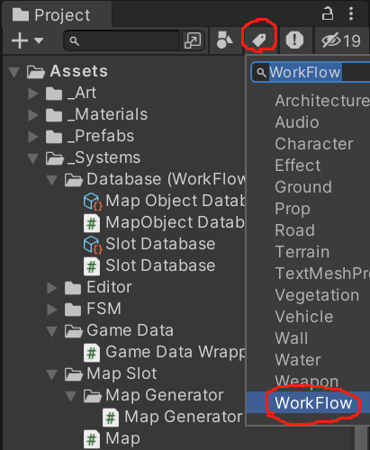

# 结构

* 地图

Map <- Slot <- MapObject

例如: 一张[地图](Assets/_Systems/Map Slot/Map.cs) <- 10*10个平原单元格 [Plain:Slot](Assets/_Systems/Map Slot/Slots.cs) <- 部分单元格上有许多房屋 [House : MapObject](Assets/_Systems/MapObjects/MapObjects.cs)

* 游戏数据

目前只做了经济方面的数据。数据以Middleware(中间件)被GameDataWrapper存储。

# 工作流

## 相关文件

我已打上标签。直接通过Unity的Search by Label查找主要的工作流文件。

## 创建Slot

- 在任意位置，创建cs文件。自写一个类，继承 `Slot`类，且嵌套于 `Slots`类中。
- 继承基类的构造函数。
- 在 `Slot Database.asset`（在UnityEditor中打开此ScritableObject）中，为新建的Slot进行配置
- [参考](Assets/_Systems/Map Slot/Slots.cs)

## 创建MapObject

与 创建Slot 类似。

[参考](Assets/_Systems/MapObjects/Instance/Tree.cs)

注：请善用Github的Go To File功能。

